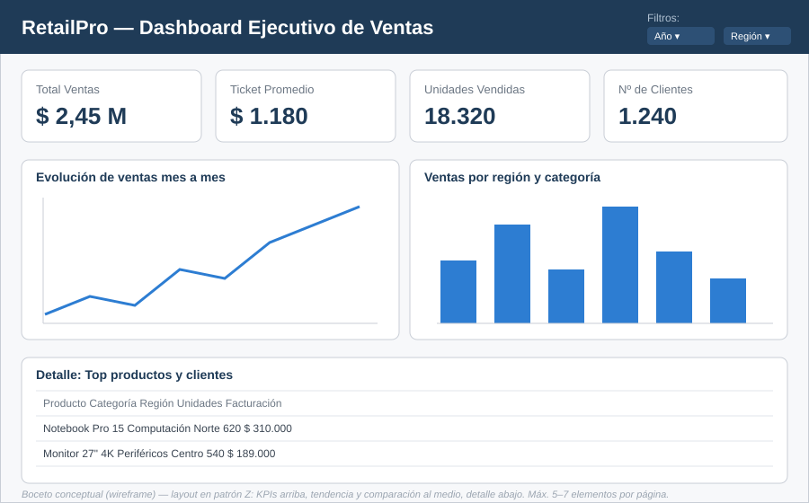

# M1 — Brief del proyecto RetailPro

> **Curso:** Data Analytics — Coderhouse (V2) · **Semana 1** · Pre-entrega evaluable
> **Formato de entrega:** 1 archivo PDF o DOCX, subido directo en la plataforma.
> **Alcance:** brief conceptual (no requiere dataset externo). Primera piedra del proyecto integrador RetailPro.

---

## Contexto del caso

**RetailPro** es una distribuidora de tecnología que comercializa computación, periféricos y accesorios a través de dos canales (online y presencial). Actualmente tiene sus datos de ventas, clientes y productos dispersos en planillas de Excel, sin un análisis sistemático. La dirección comercial detectó una caída de ingresos en una de sus regiones y necesita entender la causa para decidir dónde intervenir.

Este brief define la base estratégica del proyecto —el problema, las fuentes, las preguntas y los KPIs— antes de tocar ninguna herramienta.

---

## 1. Definición del problema de negocio

**Pregunta estratégica (diagnóstica):**

> *"¿Por qué las ventas de la región Norte cayeron un 15% en el último trimestre, y qué categoría de producto y qué canal explican esa caída?"*

Es una pregunta **diagnóstica** —busca el *por qué* y habilita una acción concreta—, no descriptiva. No pregunta *"¿cuánto vendimos?"* (métrica de vanidad), sino qué está causando el problema, para poder decidir dónde actuar: reforzar una categoría, un canal o una región. Incluye además una **magnitud** (15%) y un **período** (último trimestre), lo que la vuelve medible y acotada.

---

## 2. Fuentes de datos identificadas

El sistema se apoyará en cuatro tablas relacionadas. `ventas` es la tabla de **hechos** (registra cada transacción); las otras tres son **dimensiones** que la describen.

| Tabla | Qué contiene | Campos principales |
|-------|--------------|--------------------|
| `clientes` | Quiénes compran | `id_cliente` (PK), `nombre`, `segmento` (Consumo / PyME / Corporativo), `ciudad` |
| `productos` | Qué se vende | `id_producto` (PK), `nombre`, `categoria`, `precio_unitario` |
| `ventas` | Las transacciones | `id_venta` (PK), `fecha`, `id_cliente` (FK), `id_producto` (FK), `id_territorio` (FK), `cantidad`, `total_venta`, `canal` |
| `territorios` | Dónde ocurren las ventas | `id_territorio` (PK), `region`, `pais` |

> **Decisión de diseño:** se incluye `id_territorio` como clave foránea en `ventas` para poder analizar los ingresos por región. Este modelo se formaliza y normaliza a 3NF en el entregable **M2**.

---

## 3. Preguntas de análisis

Seis preguntas de negocio concretas que el dashboard final debe poder responder, todas alineadas con el problema de la Sección 1:

1. ¿Qué región genera más ingresos y cómo evolucionó cada una en el último año?
2. ¿Cuáles son los 10 productos más vendidos, por facturación y por unidades?
3. ¿Cómo evolucionan las ventas mes a mes? ¿Hay estacionalidad?
4. ¿Qué categoría de producto perdió más ventas en la región Norte?
5. ¿Qué segmento de clientes tiene el ticket promedio más alto?
6. ¿Qué canal (online vs. presencial) rinde mejor en cada región?

---

## 4. KPIs propuestos

Cinco indicadores clave (el mínimo pedido es 4). La fórmula es **conceptual**: se implementa con SQL en M4 y con DAX en M8.

| KPI | Descripción | Fórmula conceptual |
|-----|-------------|--------------------|
| **Total Ventas** | Monto total facturado en el período | `SUM(total_venta)` |
| **Ticket Promedio** | Gasto medio por transacción | `SUM(total_venta) / COUNT(id_venta)` |
| **Unidades Vendidas** | Cantidad total de productos vendidos | `SUM(cantidad)` |
| **Nº de Clientes** | Clientes únicos que compraron | `COUNT(DISTINCT id_cliente)` |
| **Variación vs. Trimestre Anterior** | Crecimiento/caída respecto al período previo | `(Ventas_actual − Ventas_previo) / Ventas_previo` |

> El último KPI conecta directamente con la pregunta diagnóstica: es el que expone la caída del 15%.

---

## 5. Boceto del dashboard

Layout en **patrón Z**, respetando la regla de 5–7 elementos visuales por página: los KPIs en la zona de oro (arriba), tendencia y comparación al medio, tabla de detalle abajo, y filtros arriba a la derecha.

**Lógica de distribución:**

- **KPIs (arriba):** resumen de un vistazo, lo primero que ve un ejecutivo.
- **Líneas (centro izq.):** la evolución mensual responde *"¿cómo venimos?"*.
- **Barras (centro der.):** la comparación por región y categoría responde *"¿dónde está el problema?"*.
- **Tabla (abajo):** el detalle por producto y cliente para profundizar.
- **Filtros (año / región):** segmentan todo el reporte.

---

## Checklist de entrega

- [x] 1 archivo único en **PDF o DOCX**.
- [x] Incluye las **5 secciones**: problema, fuentes, preguntas, KPIs y boceto.
- [x] El **boceto** va como **imagen** dentro del documento.
- [x] Es un **brief conceptual** (no requiere dataset externo).
- [ ] Se sube **directo en la plataforma**.
