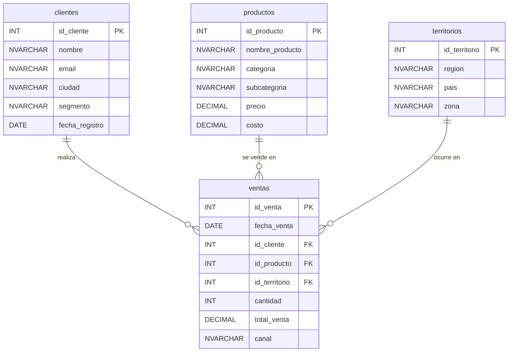
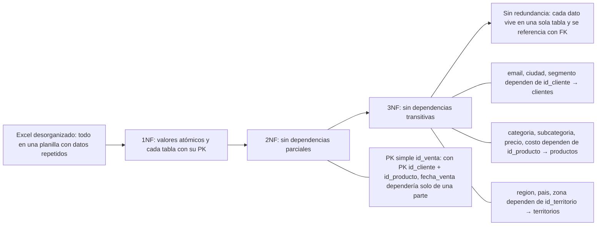
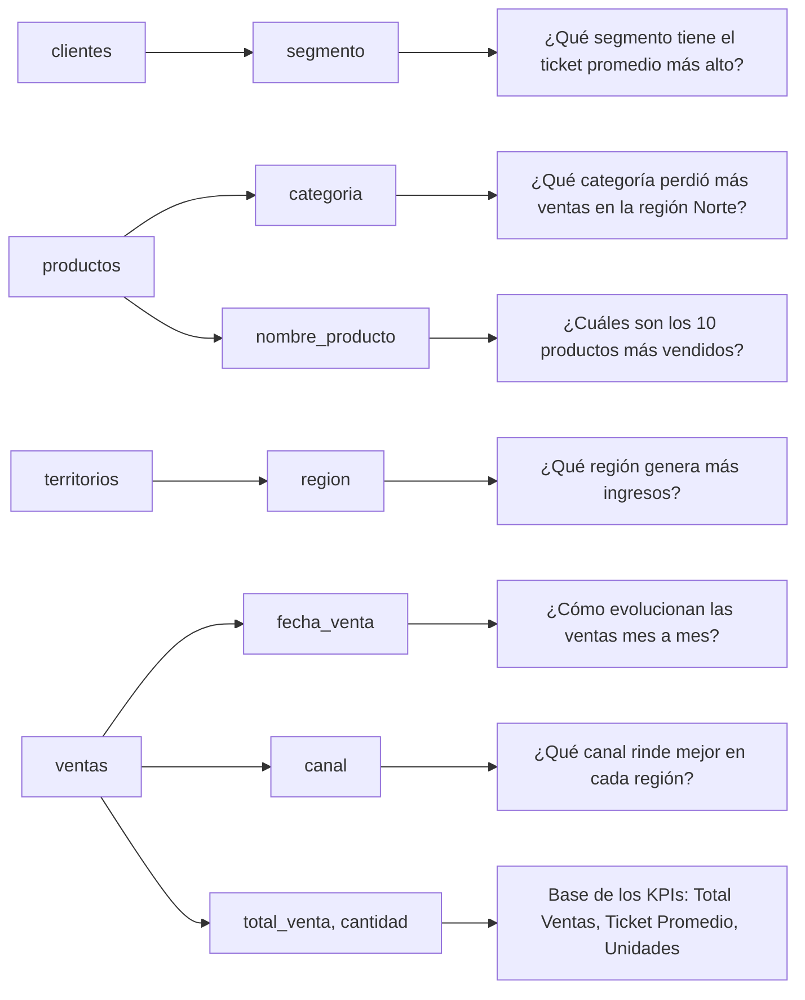

# DER — RetailPro (Entregable M2)

> **Este es el modelo tal como se diseña en M2:** cuatro tablas, con `categoria` y `subcategoria` como columnas de `productos`. La base implementada más adelante ([`RetailPro_DB`](../recursos/base-de-datos/)) va **un paso más allá** y normaliza `categorias` en su propia tabla — son cinco tablas. Si comparás los dos diagramas y no coinciden, es por eso: el DER de M2 es el diseño de la semana 2, el [`.dbml`](./der-retailpro.dbml) refleja la base real.

---

## 2. Justificación de normalización (3NF)

---

## 3. Conexión con el brief de M1

