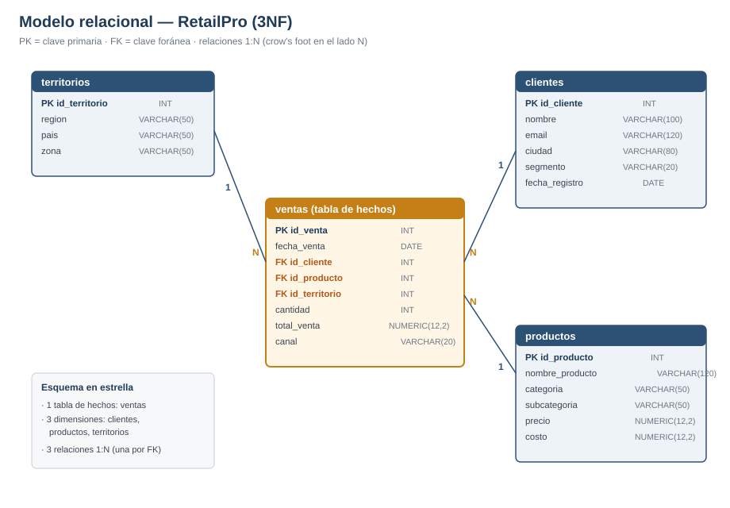

# M2 — Modelo de datos RetailPro (3NF)

> **Curso:** Data Analytics — Coderhouse (V2) · **Semana 2** · Pre-entrega evaluable
> **Formato de entrega:** 1 archivo PDF o DOCX con el diagrama ER (como imagen) y las justificaciones, subido directo en la plataforma.
> **Alcance:** diseño del modelo relacional normalizado hasta **3NF**. Es el plano que se implementa en SQL en M3.

---

## 1. Diagrama ER

Modelo relacional de RetailPro: un **esquema en estrella** con `ventas` como tabla de hechos y `clientes`, `productos` y `territorios` como dimensiones. Cada relación es **1:N** (una fila de dimensión participa en muchas ventas).

### Especificación de tablas (columnas mínimas y tipos)

Los tipos siguen convención **PostgreSQL**. Regla del curso: **`NUMERIC`/`DECIMAL` para dinero, nunca `FLOAT`** (evita errores de redondeo).

**`clientes`** — dimensión: quiénes compran

| Columna | Tipo | Clave | Restricciones |
|---------|------|-------|---------------|
| `id_cliente` | `INT` | **PK** | `NOT NULL` |
| `nombre` | `VARCHAR(100)` | | `NOT NULL` |
| `email` | `VARCHAR(120)` | | `UNIQUE` |
| `ciudad` | `VARCHAR(80)` | | |
| `segmento` | `VARCHAR(20)` | | `CHECK (Consumo / PyME / Corporativo)` |
| `fecha_registro` | `DATE` | | `NOT NULL` |

**`productos`** — dimensión: qué se vende

| Columna | Tipo | Clave | Restricciones |
|---------|------|-------|---------------|
| `id_producto` | `INT` | **PK** | `NOT NULL` |
| `nombre_producto` | `VARCHAR(120)` | | `NOT NULL` |
| `categoria` | `VARCHAR(50)` | | `NOT NULL` |
| `subcategoria` | `VARCHAR(50)` | | |
| `precio` | `NUMERIC(12,2)` | | `CHECK (precio >= 0)` |
| `costo` | `NUMERIC(12,2)` | | `CHECK (costo >= 0)` |

**`territorios`** — dimensión: dónde ocurre la venta

| Columna | Tipo | Clave | Restricciones |
|---------|------|-------|---------------|
| `id_territorio` | `INT` | **PK** | `NOT NULL` |
| `region` | `VARCHAR(50)` | | `NOT NULL` |
| `pais` | `VARCHAR(50)` | | `NOT NULL` |
| `zona` | `VARCHAR(50)` | | |

**`ventas`** — tabla de hechos: las transacciones

| Columna | Tipo | Clave | Restricciones |
|---------|------|-------|---------------|
| `id_venta` | `INT` | **PK** | `NOT NULL` |
| `fecha_venta` | `DATE` | | `NOT NULL` |
| `id_cliente` | `INT` | **FK → clientes** | `NOT NULL` |
| `id_producto` | `INT` | **FK → productos** | `NOT NULL` |
| `id_territorio` | `INT` | **FK → territorios** | `NOT NULL` |
| `cantidad` | `INT` | | `CHECK (cantidad > 0)` |
| `total_venta` | `NUMERIC(12,2)` | | `CHECK (total_venta >= 0)` |
| `canal` | `VARCHAR(20)` | | `CHECK (Online / Presencial)` |

> **Decisión de diseño documentada:** la consigna lista `territorios` pero no especifica dónde va la FK que la conecta. Se coloca `id_territorio` como **FK en `ventas`** para registrar en qué territorio ocurrió cada transacción; así se puede responder "¿qué región genera más ingresos?" cruzando `ventas.total_venta` con `territorios.region`. Es la ubicación correcta porque la región es un atributo del **hecho** (la venta), no del cliente.

---

## 2. Justificación de normalización (3NF)

El modelo cumple las tres primeras formas normales:

**1NF — valores atómicos, sin grupos repetidos.**
Cada columna guarda un único valor indivisible y cada tabla tiene PK. No hay campos multivaluados (por ejemplo, no se guarda una lista de productos dentro de una fila de `ventas`: cada producto vendido es una fila propia).

**2NF — sin dependencias parciales.**
Se cumple 1NF y todo atributo no clave depende de la **clave completa**. Todas las tablas usan una **PK simple (surrogate key)** de una sola columna, por lo que no pueden existir dependencias parciales (que solo aparecen con claves compuestas). Ejemplo evitado: si `ventas` hubiera usado una PK compuesta `(id_cliente, id_producto)`, atributos como `fecha_venta` dependerían de toda la venta y no de parte de la clave; con `id_venta` como PK única, el problema no se presenta.

**3NF — sin dependencias transitivas.**
Ningún atributo no clave depende de otro atributo no clave. Las dependencias transitivas se eliminaron separando cada entidad en su propia tabla:

- `categoria` y `subcategoria` dependen de `id_producto`, **no** de `id_venta`. → viven en `productos`, no en `ventas`.
- `email`, `ciudad` y `segmento` dependen de `id_cliente`, **no** de `id_venta`. → viven en `clientes`.
- `region`, `pais` y `zona` dependen de `id_territorio`, **no** de `id_venta`. → viven en `territorios`.

**Sin redundancia.**
Los datos de cada cliente, producto y territorio se almacenan **una sola vez** y se referencian desde `ventas` mediante claves foráneas. Si cambia el email de un cliente, se actualiza en una única fila. `ventas` solo guarda las FK y las medidas propias del hecho (`cantidad`, `total_venta`), evitando duplicar descripciones.

> **Nota técnica sobre `total_venta`:** es un valor **derivado** (`cantidad × precio`, con posibles descuentos). Se conserva de forma explícita porque el precio de un producto puede variar con el tiempo, y la venta debe registrar el importe **real** al momento de la transacción, no el precio actual del catálogo. Esto es una decisión de negocio válida, no una violación de 3NF.

---

## 3. Conexión con el brief de M1

Cada tabla habilita al menos una de las preguntas de análisis definidas en M1, a través de una columna concreta:

| Tabla | Columna clave | Pregunta de M1 que ayuda a responder |
|-------|---------------|--------------------------------------|
| `territorios` | `region` | ¿Qué región genera más ingresos? (cruce con `ventas.total_venta`) |
| `productos` | `categoria` | ¿Qué categoría perdió más ventas en el Norte? · Top productos |
| `clientes` | `segmento` | ¿Qué segmento de clientes tiene el ticket promedio más alto? |
| `ventas` | `fecha_venta` | ¿Cómo evolucionan las ventas mes a mes? (estacionalidad) |
| `ventas` | `canal` | ¿Qué canal (Online / Presencial) rinde mejor en cada región? |
| `ventas` | `total_venta`, `cantidad` | Base de todos los KPIs (Total Ventas, Ticket Promedio, Unidades) |

---

## Checklist de entrega

- [x] 1 archivo único en **PDF o DOCX**.
- [x] **Diagrama ER** incluido como **imagen**, con PK y FK visibles.
- [x] Las 4 tablas obligatorias con sus **columnas mínimas** y **tipos de datos**.
- [x] Párrafo de **justificación de normalización (3NF)** con dependencias parciales y transitivas.
- [x] **Conexión con las preguntas de M1** para cada tabla.
- [ ] Se sube **directo en la plataforma**.

> **Puente a M3:** este modelo se implementa tal cual en SQL — `CREATE TABLE` con estos tipos, `PRIMARY KEY`/`FOREIGN KEY` según el diagrama, y las `CHECK` listadas como restricciones de integridad.
