# Esquemas — Semana 2: OLTP vs OLAP y Normalización

> Cada bloque se pega por separado en **Excalidraw → Más herramientas → Mermaid to Excalidraw**.
> Pensado para quien escucha estos conceptos por primera vez.

---

## 1. OLTP vs OLAP — la analogía

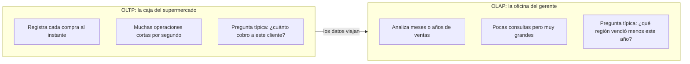

---

## 2. El viaje del dato: de la operación a la decisión

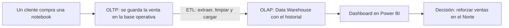

---

## 3. Cara a cara: OLTP vs OLAP

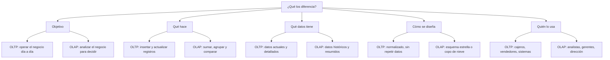

---

## 4. ¿Dónde se usan?

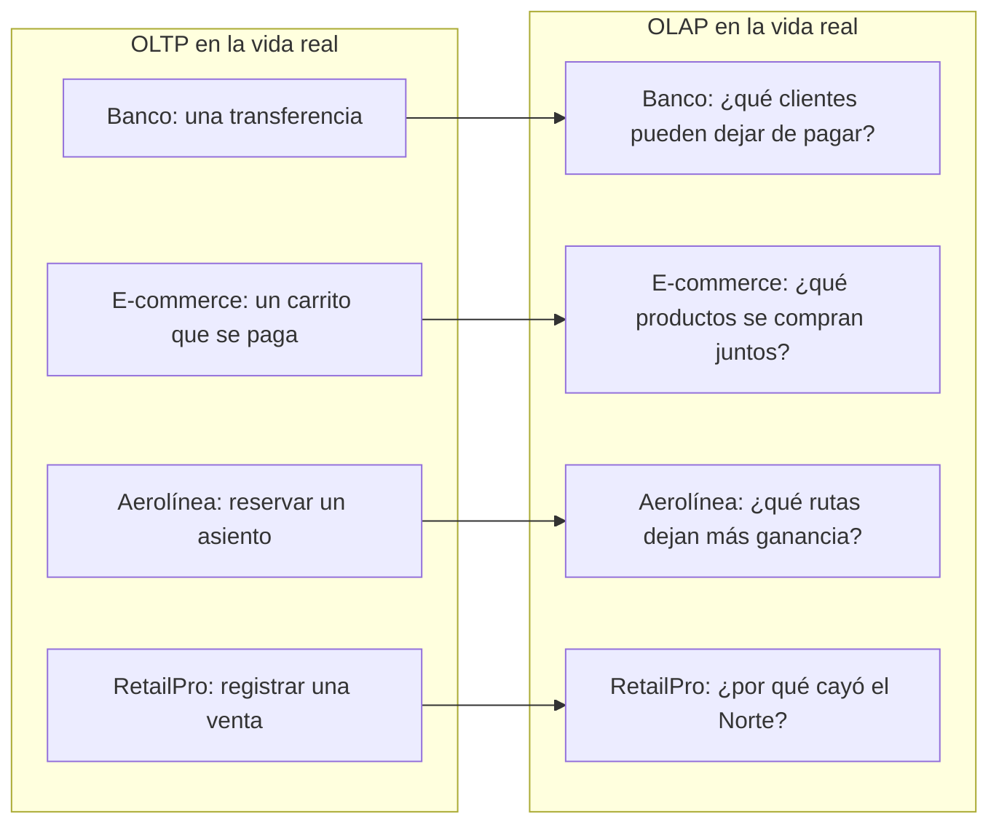

---

## 5. ¿Por qué es importante separarlos?

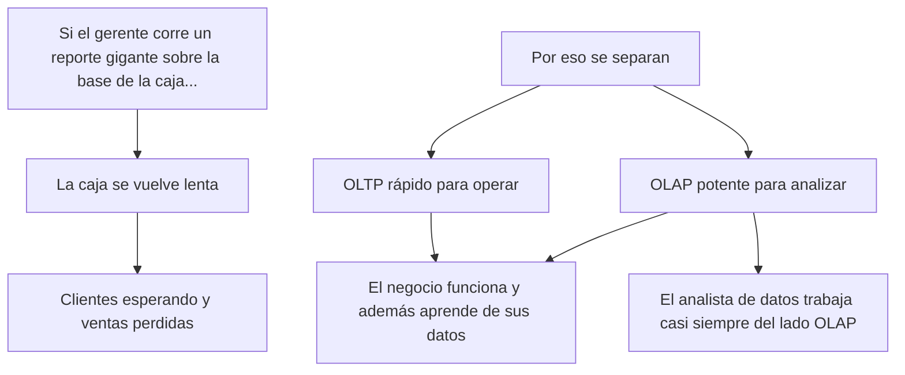

---

## 6. Normalización — el problema: todo en una planilla

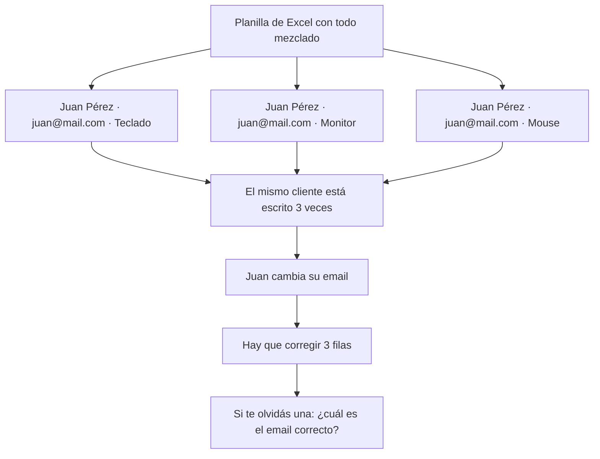

---

## 7. Las 3 anomalías: por qué normalizar

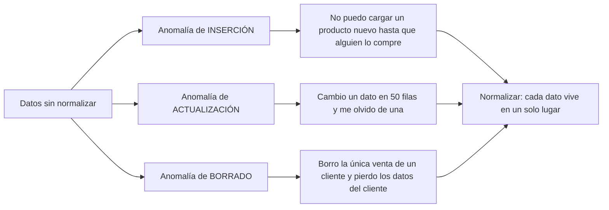

---

## 8. La escalera de la normalización

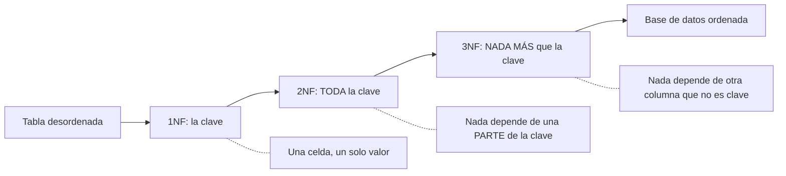

> **Regla de oro:** cada columna debe depender *de la clave, de toda la clave y de nada más que la clave*.

---

## 9. Primera Forma Normal (1NF): una celda, un valor

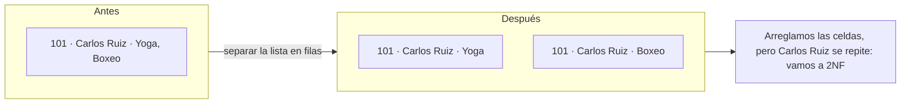

---

## 10. Segunda Forma Normal (2NF) — paso 1: ¿qué es una clave compuesta?

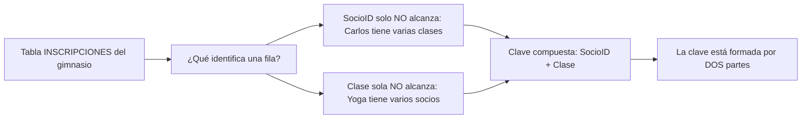

---

## 11. Segunda Forma Normal (2NF) — paso 2: la pregunta mágica

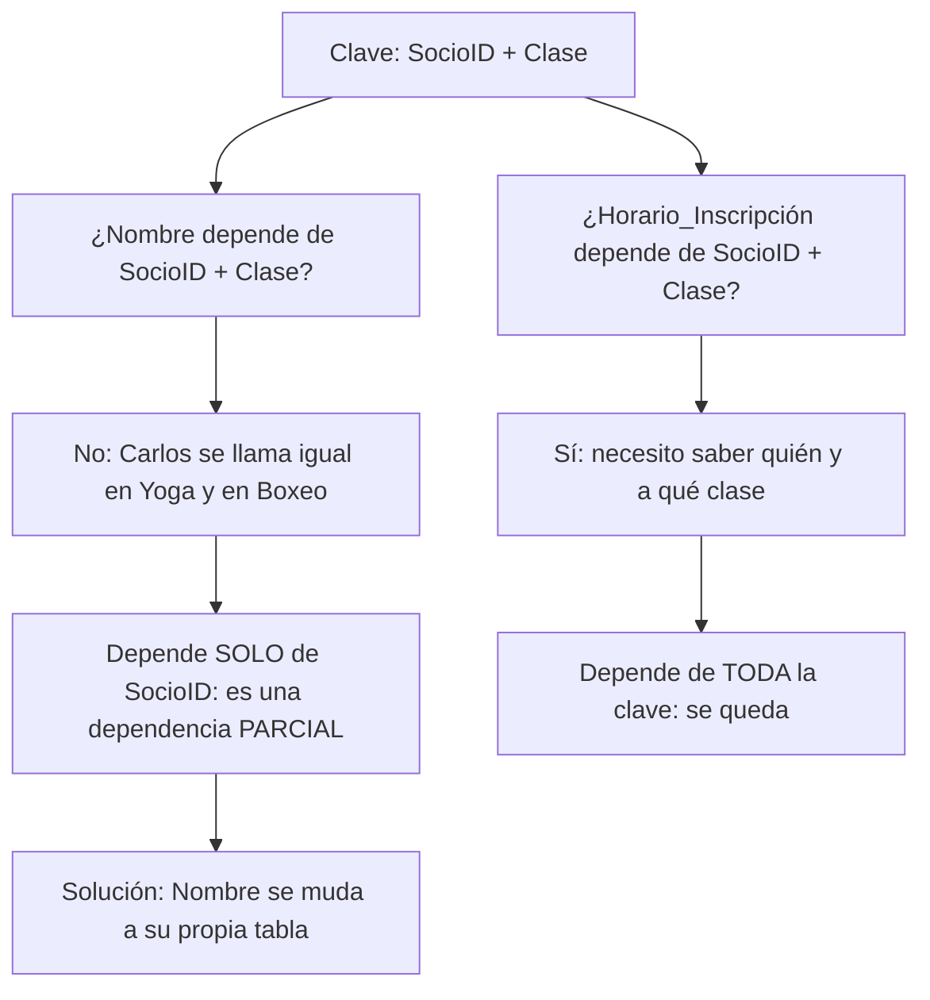

---

## 12. Segunda Forma Normal (2NF) — paso 3: dividir para vencer

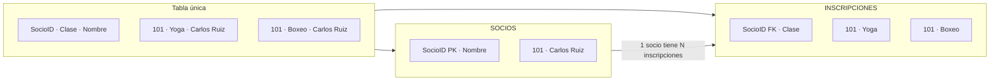

---

## 13. 2NF en RetailPro: el detalle de un pedido

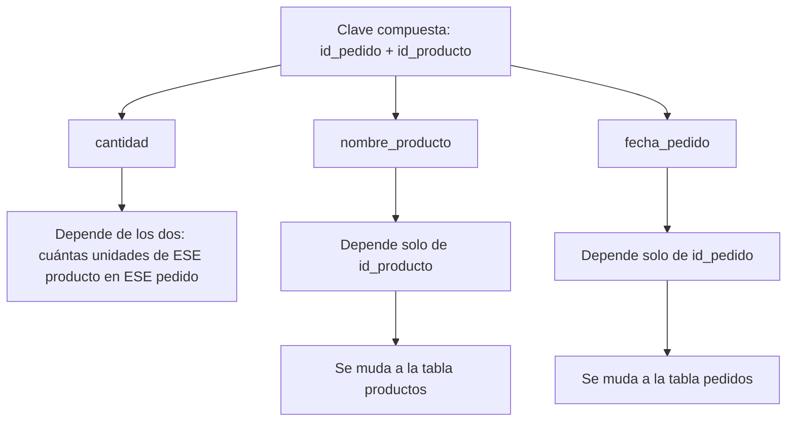

> Si la tabla tiene una **clave de una sola columna** (como `id_venta`), no puede haber dependencias parciales: ya cumple 2NF automáticamente.

---

## 14. Tercera Forma Normal (3NF) — el efecto dominó

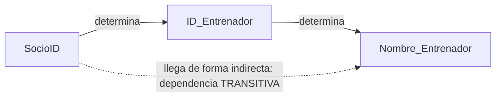

> El nombre del entrenador **no** depende del socio: depende del entrenador. El socio solo "llega" a ese dato pasando por otra columna.

---

## 15. Tercera Forma Normal (3NF) — la pregunta mágica

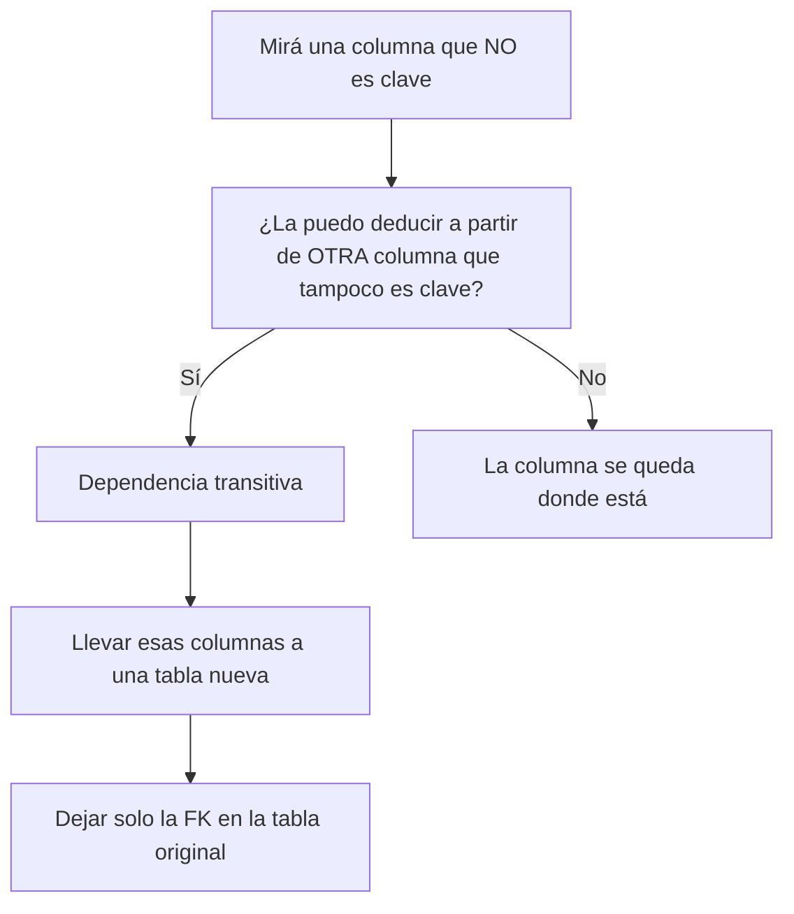

---

## 16. Tercera Forma Normal (3NF) — la solución

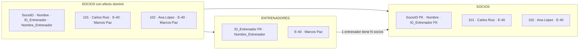

> Si Marcos Paz corrige su nombre, se cambia en **una sola fila**.

---

## 17. 3NF en RetailPro: ciudad y provincia

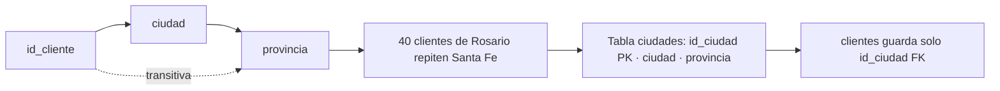

---

## 18. 2NF vs 3NF: ¿cómo no confundirlas?

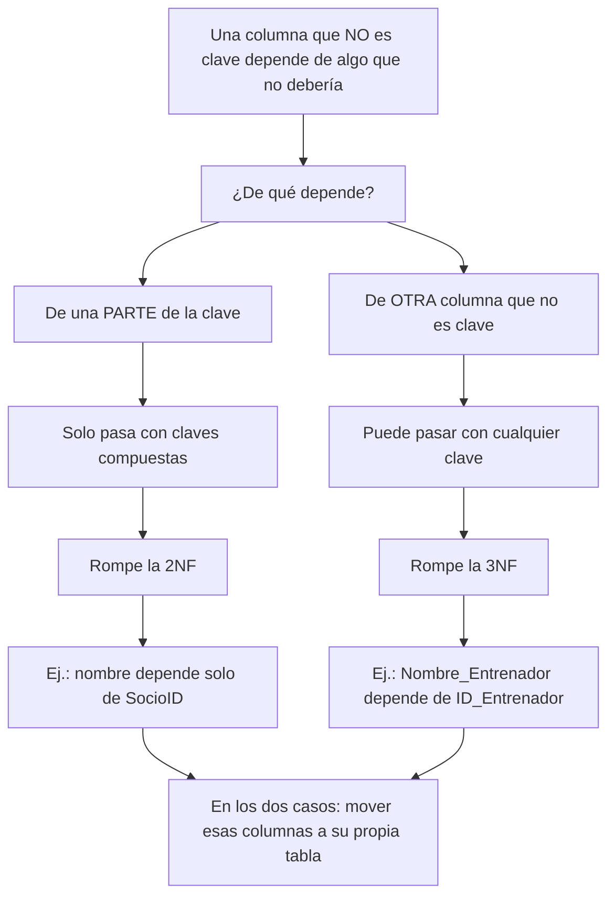
