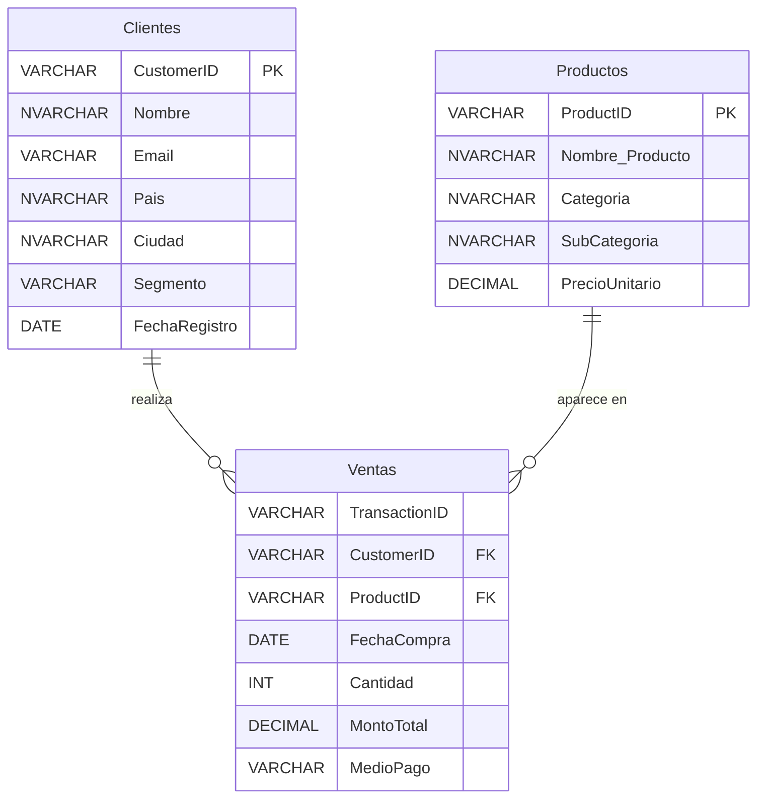

# 🎓 Ejemplo de Examen Final — Ventas Retail

Material **oficial** que acompaña al Proyecto Final ([Semana 11](../../Semana-11-Proyecto-Final/)). Es el *"Ejemplo de Ex Final"* que menciona la consigna: el dataset que podés usar **si no encontrás un dataset adecuado en Kaggle**, más un ejemplo de entrega resuelta.

> ⚠️ **Es material de referencia, no una plantilla para copiar.** El ejemplo resuelto muestra el *nivel y la estructura* esperados. Tu proyecto debe tener tu propia pregunta de negocio, tu propio análisis y tus propias conclusiones.

---

## 📦 Qué hay en esta carpeta

| Archivo | Para qué sirve |
|---------|----------------|
| [`datos/dataset_ventas_retail.xlsx`](./datos/dataset_ventas_retail.xlsx) | El dataset completo en Excel, con tres hojas: **Ventas**, **Clientes** y **Productos**. Es la vía más rápida para empezar con Power BI o Power Query. |
| [`datos/ventas.csv`](./datos/ventas.csv) · [`datos/clientes.csv`](./datos/clientes.csv) · [`datos/productos.csv`](./datos/productos.csv) | Las mismas tres tablas en CSV, por si preferís cargarlas sueltas o importarlas a otra herramienta. |
| [`script_sqlserver.sql`](./script_sqlserver.sql) | Crea la base `RetailVentas` en **SQL Server** con las tres tablas, sus FK, sus índices y los 3.225 registros (200 clientes + 25 productos + 3.000 ventas). |
| [`script_mysql_workbench.sql`](./script_mysql_workbench.sql) | Lo mismo para **MySQL / Workbench** (base `retail_ventas`). |
| `proyecto_final_data_analytics.pptx` | Ejemplo de entrega resuelta, de punta a punta (contexto → dataset → teoría → EDA → limpieza → SQL/ER → storytelling → conclusiones). |

> 🗄️ **Sobre `RetailVentas.bak`:** el backup de SQL Server que viene con el material original **no se versiona** en este repositorio (son ~11 MB de binario y `.gitignore` excluye `*.bak`). No hace falta: `script_sqlserver.sql` genera exactamente la misma base. Si querés el `.bak` para restaurarlo directo, pedíselo a tu tutor/a.

---

## 🧱 El modelo de datos

Tres tablas, esquema en estrella, `Ventas` como tabla de hechos:



> 🔍 **`TransactionID` no es PK.** El dataset trae **5 identificadores repetidos** a propósito, así que la tabla se crea sin clave primaria en `Ventas`. Detectar y tratar esos duplicados es parte del ejercicio de limpieza.

### Volumen y contenido real

| | |
|---|---|
| **Ventas** | 3.000 transacciones |
| **Clientes** | 200 (8 países · segmentos Básico / Estándar / Premium) |
| **Productos** | 25 (categorías **Tecnología** 12 · **Accesorios** 9 · **Muebles** 4) |
| **Período** | 2024-04-05 a **2025-04-07** |
| **Medios de pago** | Tarjeta Crédito · Tarjeta Débito · Transferencia · PayPal · Efectivo |
| **Facturación** | ≈ 1.249.664 (sumando las filas con `MontoTotal` informado) |

---

## 🧹 La "suciedad" del dataset es intencional

El Paso 2 de la consigna pide **limpiar los datos antes de consultar**. Esto es lo que vas a encontrar:

| Problema | Dónde | Cuánto |
|----------|-------|--------|
| `MontoTotal` vacío / `NULL` | `Ventas` | **10 filas** |
| `Cantidad` vacía / `NULL` | `Ventas` | **20 filas** |
| `TransactionID` duplicado | `Ventas` | **5 identificadores** |
| `Cantidad` con formato decimal (`4.0` en vez de `4`) | `ventas.csv` | toda la columna |

> 💡 Documentá **qué hiciste con cada uno** (¿eliminaste las filas? ¿imputaste? ¿recalculaste `MontoTotal` como `Cantidad × PrecioUnitario`?) y **por qué**. Esa justificación es justamente lo que se evalúa en la sección de transformación y limpieza.

---

## 🗓️ Cuidado con los "últimos 30 días"

La consigna es explícita: los últimos 30 días se cuentan **desde la fecha de la última venta del dataset**, no desde hoy.

Los scripts de ejemplo traen, en su sección 5, la consulta escrita con `GETDATE()` / `CURDATE()`. Se dejaron **tal cual vinieron** en el material original, pero ojo: como los datos terminan el **2025-04-07**, esa versión devuelve **0 filas** cuando la corrés hoy. Usá esta en su lugar:

```sql
-- SQL Server
SELECT
    c.Nombre      AS nombre_cliente,
    v.FechaCompra AS fecha_compra,
    v.MontoTotal  AS total_venta
FROM Ventas v
INNER JOIN Clientes c ON v.CustomerID = c.CustomerID
WHERE v.FechaCompra >= DATEADD(DAY, -30, (SELECT MAX(FechaCompra) FROM Ventas))
  AND v.MontoTotal IS NOT NULL
ORDER BY v.FechaCompra DESC;
```

```sql
-- MySQL
SELECT
    c.Nombre      AS nombre_cliente,
    v.FechaCompra AS fecha_compra,
    v.MontoTotal  AS total_venta
FROM ventas v
INNER JOIN clientes c ON v.CustomerID = c.CustomerID
WHERE v.FechaCompra >= DATE_SUB((SELECT MAX(FechaCompra) FROM ventas), INTERVAL 30 DAY)
  AND v.MontoTotal IS NOT NULL
ORDER BY v.FechaCompra DESC;
```

> ✅ **Resultado esperado:** ventana del **2025-03-08 al 2025-04-07**, **257 transacciones**. Si te da 0, estás filtrando contra la fecha de hoy.

---

## 🚀 Cómo arrancar

**Si vas por SQL** (Ejercicio 1 y sección "Modelo de datos y consultas SQL"):
1. Abrí `script_sqlserver.sql` en SSMS (o `script_mysql_workbench.sql` en Workbench).
2. Ejecutalo completo. El script **borra y recrea** la base, así que podés correrlo las veces que quieras.
3. Verificá con la sección 4 del script: deben salir 200 clientes, 25 productos y 3.000 ventas.

**Si vas por Power BI / Excel** (EDA, limpieza y dashboard):
1. `Obtener datos > Excel` y elegí `datos/dataset_ventas_retail.xlsx`.
2. Importá las **tres hojas por separado** — no las combines en una tabla plana, o perdés el ejercicio de modelado.
3. En Power Query, tratá los nulos y duplicados de la tabla anterior antes de cargar.

> 🔤 Si al abrir los `.sql` ves caracteres raros (`ó`, `ñ`), reabrí el archivo forzando codificación **UTF-8**.

---

## ⚠️ El PPTX de ejemplo no coincide con estos datos

El ejemplo resuelto se armó sobre una **versión anterior y más chica** del dataset. Sirve perfectamente como referencia de **estructura y nivel de profundidad**, pero sus números **no** son los de los archivos de esta carpeta:

| | En el PPTX | En estos archivos |
|---|---|---|
| Ventas | 2.000 | **3.000** |
| Productos | 10 | **25** |
| Nulos | 15, solo en `Quantity` | **20** en `Cantidad` + **10** en `MontoTotal` |
| Duplicados | "no se detectaron" | **5** `TransactionID` repetidos |
| Nombres de columnas | inglés (`CustomerName`, `Date`, `TotalSale`) | español (`Nombre`, `FechaCompra`, `MontoTotal`) |
| Últimos 30 días | 167 transacciones | **257** |

> 👉 **No copies sus cifras.** Calculá las tuyas sobre los datos reales y vas a tener números distintos (y correctos).

---
<p align="center">
<a href="../">⬅️ Recursos</a> · 🏠 <a href="../../README.md">Índice del curso</a> · <a href="../../Semana-11-Proyecto-Final/">Semana 11 — Proyecto Final ➡️</a>
</p>
